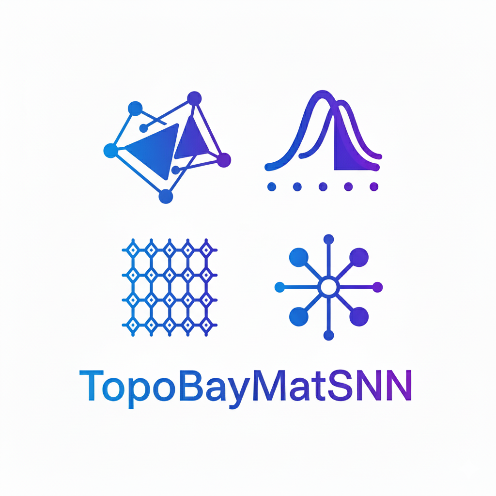

# TopoBayMatSNN

**TopoBayMatSNN** is a scientific machine learning environment tailored for modeling materials using Bayesian neural networks, topological deep learning, and simplicial neural networks.

  
  

---
*This logo symbolizes the intersection of material structure, probabilistic reasoning, topological geometry, and GNNs.*
